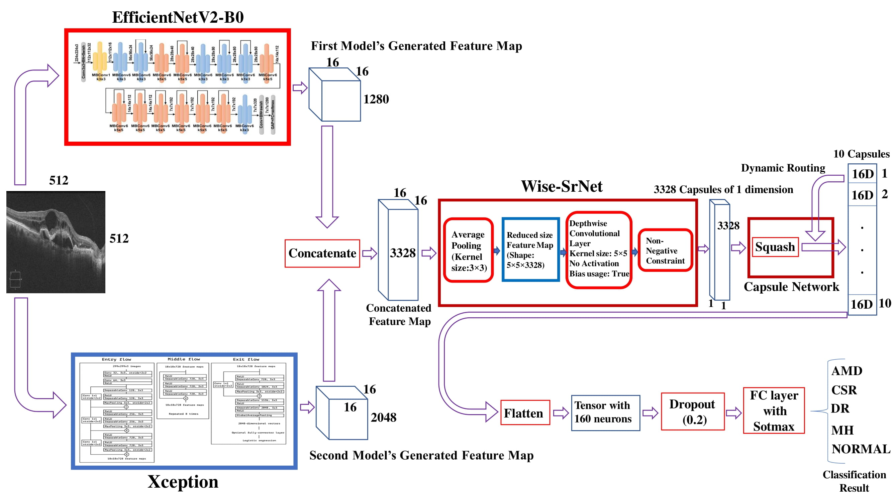

# ROCT-Net: A new ensemble deep convolutional model with improved spatial resolution learning for detecting common diseases from retinal OCT images

Optical coherence tomography (OCT) imaging is a well-known technology for visualizing retinal layers and helps ophthalmologists to detect possible diseases. Accurate and early diagnosis of common retinal diseases can prevent the patients from suffering critical damages to their vision. Computer-aided diagnosis (CAD) systems can significantly assist ophthalmologists in improving their examinations. This paper presents a new enhanced deep ensemble convolutional neural network for detecting retinal diseases from OCT images. Our model generates rich and multi-resolution features by employing the learning architectures of two robust convolutional models. Spatial resolution is a critical factor in medical images, especially the OCT images that contain tiny essential points. To empower our model, we apply a new post-architecture model to our ensemble model for enhancing spatial resolution learning without increasing computational costs. The introduced post-architecture model can be deployed to any feature extraction model to improve the utilization of the feature map’s spatial values. We have collected two open-source datasets for our experiments to make our models capable of detecting six crucial retinal diseases: Age-related Macular Degeneration (AMD), Central Serous Retinopathy (CSR), Diabetic Retinopathy (DR), Choroidal Neovascularization (CNV), Diabetic Macular Edema (DME), and Drusen alongside the normal cases. Our experiments on two datasets and comparing our model with some other well-known deep convolutional neural networks have proven that our architecture can increase the classification accuracy up to 5%. We hope that our proposed methods create the next step of CAD systems development and help future researches.

# Dataset

Most of the OCT datasets include few images of 2 or 3 types of disease. In order to expand our investigations and validate our results, we ran our experiments on two datasets.
The first is the [Kermany dataset](https://data.mendeley.com/datasets/rscbjbr9sj/3) which is a large dataset containing 108,312 images (37,206 with CNV, 11,349 with DME, 8,617 with DRUSEN, and 51,140 Normal) from 4,686 patients for training and 1000 images from 633 patients for evaluating the models.</br>
The second dataset is named [OCTID](https://www.sciencedirect.com/science/article/abs/pii/S0045790618330842) and belongs to the waterloo university. It includes 572 images of 5 classes: Normal, AMD, CSR, DR, and MH. In the Kermany dataset, each patient has several OCT images. We selected one image of each patient in the training set to reduce the data size, but we kept the same test set for evaluation. In the second dataset, we allocated 20% of images of each class for testing, and the rest were used for training the models. The details of the data distribution of our work are
presented in the table.1.


  Dataset | Number of Classes | Training Images | Testing Images | AMD | CSR | DR | MH | CNV | DME | DRUSEN | NORMAL |
------------ | ------------- | ------------- | -------------  | -------------  | -------------  | -------------  | -------------  | -------------  | -------------  | -------------  | -------------  
 [Kermany](https://data.mendeley.com/datasets/rscbjbr9sj/3)| 4 | 3213 | 1000 | N/A | N/A | N/A | N/A | 791/250 | 709/250 | 713/250 | 1000/250 |
[OCTID](https://www.sciencedirect.com/science/article/abs/pii/S0045790618330842) | 5 | 459 | 113 | 44/11 | 82/20 | 86/21 | 85/20 | N/A | N/A | N/A | 165/41 

Table. 1 : This table shows the details of the utilized dataset in the paper. "/" divides the training and testing images of each class.

# Our Architecture

Our final architecture is presented in Fig. 1. The ensemble model, which has been produced by merging the architectures of Xception and EfficientNetB0, and the [Wise-SrNet](https://arxiv.org/abs/2104.12294) architecture was implemented on its end. The output of the Wise-SrNet is a compressed feature map with a 1x1x3328 shape that contains both the spatial and channel data. Our new architecture takes the final feature map and feeds it to a capsule network with some specific parameters to finally produce 10 number of 16D capsules using three routing iterations and the squash function. The main difference of our model with the typical capsule networks is that we did not use any reshaping, and the final feature map has entered the capsule network with shape 1x3328, meaning it is like to have 3328 number of 1D capsules. The second main difference is that the final output of our capsule network will be 10 number of 16D capsules while we have four classes in the first dataset and five classes in the second dataset. But why 10 capsules? 
Our experiments prove that getting the final classification array from the capsule network will not work fine in our developed architecture. Hence, we gather a 10x16 matrix from the capsule network, which is an additionally processed version of the compressed feature map produced by Wise-SrNet. This way, we will maximize the spatial resolution learning process and increase its efficiency to get the higher possible results. It must also be noted that the capsule networks’ reconstruction process has not been utilized in our architecture and training procedure. Then the capsule network’s generated array (additionally compressed feature map) would be flattened and fed to a dropout and fully connected layer with softmax activation function to form the final classification array. Using dropout and an additional process of the capsule output array will also enhance the learning performance and decrease overfitting possibility.

<p align="center">
    
    <br>
    <em> Fig.1. The architecture of our model</em>
</p>

# Comparison with Other Works

Most of the previous works in this field are based on detecting one or two diseases from OCT images. As we explore detecting several diseases in two different datasets, there are few works whose research criteria are similar to ours. In table. IV, we have compared our model with some other researches. It is evident from table. IV that our model outperforms the previous methods. The notable point is that on the Kermany dataset, we only used 3213 training images while the original paper adopted the whole 108,312 images for training the models. It can be concluded that our proposed model can reach higher accuracy when training on much fewer data. This statement shows the learning capability of our model and introduced methods.

It is evident from next table that our model outperforms the previous methods. The notable point is that on the Kermany dataset, we only used 3213 training images while the original paper adopted the whole 108,312 images for training the models. It can be concluded that our proposed model can reach higher accuracy when training on much fewer data.
This statement shows the learning capability of our model and introduced methods.

  Methods | Dataset | Training Images | Evaluation Images | Overall Accuracy |
------------ | ------------- | ------------- | -------------  | -------------   
[Singh](https://arxiv.org/abs/2101.12041) | OCTID | 459 | 113 | 0.9140
Our Model | OCTID | 459 | 113 | 0.9646
[IncptionV3](https://www.sciencedirect.com/science/article/pii/S0092867418301545) | Kermany | 108,312 | 1000 | 0.9610
Our Model | Kermany | 3213 | 1000 | 0.9870


<p align="center">
    
    <br>
    <em> This figure clarifies that our proposed model achieves higher results compared to vanilla models and architectures. The left and right figures are based on training
on the Kermany, and OCTID datasets, respectively.</em>
</p>

# Source Code

Training ROCT-Net on the [OCTID](https://www.sciencedirect.com/science/article/abs/pii/S0045790618330842) dataset: [ROCT_Net_OCTID_dataset.ipynb](https://github.com/mr7495/OCT-classification/blob/main/ROCT_Net_OCTID_dataset.ipynb)

Training ROC-Net on the [Kermany](https://data.mendeley.com/datasets/rscbjbr9sj/3) Dataset: [ROCT_Net_Kermany_Dataset.ipynb](https://github.com/mr7495/OCT-classification/blob/main/ROCT_Net_Kermany_Dataset.ipynb)

Training ROCT-Net without using capsule layers on the [Kermany](https://data.mendeley.com/datasets/rscbjbr9sj/3) Dataset: [ROCT_Net_without_Capsules_Kermany_Dataset.ipynb](https://github.com/mr7495/OCT-classification/blob/main/ROCT_Net_without_Capsules_Kermany_Dataset.ipynb)

**Warning: Model saving function in keras does not save the weights produced by capsule layers, so your saved models will not be as equal as the trained model. This bug should be fixed in the future. If you wish to save your model, anyway, using the classic model.save function in Keras, use the without-capsule version of ROCT-Net [ROCT_Net_without_Capsules_Kermany_Dataset.ipynb](https://github.com/mr7495/OCT-classification/blob/main/ROCT_Net_without_Capsules_Kermany_Dataset.ipynb) code.**

**The published version of our paper is available at:** </br>
 https://doi.org/10.1109/ICCKE54056.2021.9721471
 
 
**If you use our data or codes, please cite it by:**
 ```
@INPROCEEDINGS{9721471,
  author={Rahimzadeh, Mohammad and Mohammadi, Mahmoud Reza},
  booktitle={2021 11th International Conference on Computer Engineering and Knowledge (ICCKE)}, 
  title={ROCT-Net: A new ensemble deep convolutional model with improved spatial resolution learning for detecting common diseases from retinal OCT images}, 
  year={2021},
  pages={85-91},
  doi={10.1109/ICCKE54056.2021.9721471}}
 ```

# References

1- Kermany D, Goldbaum M, Cai W et al. Identifying Medical Diagnoses and Treatable Diseases by Image-Based Deep Learning. Cell. 2018; 172(5):1122-1131. doi:10.1016/j.cell.2018.02.010

2- Gholami, P., Roy, P., Parthasarathy, M.K. and Lakshminarayanan, V., 2020. OCTID: Optical coherence tomography image database. Computers & Electrical Engineering, 81, p.106532.

3- Rahimzadeh, M., Parvin, S., Safi, E. and Mohammadi, M.R., 2021. Wise-srnet: A novel architecture for enhancing image classification by learning spatial resolution of feature maps. arXiv preprint arXiv:2104.12294.

4- Tan, M. and Le, Q., 2021, July. Efficientnetv2: Smaller models and faster training. In International Conference on Machine Learning (pp. 10096-10106). PMLR.

5-Chollet, F., 2017. Xception: Deep learning with depthwise separable convolutions. In Proceedings of the IEEE conference on computer vision and pattern recognition (pp. 1251-1258).


If you have any questions, contact me by this email : mr7495@yahoo.com

